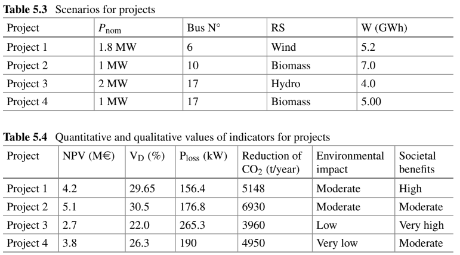

```{r setup, include=FALSE}
knitr::opts_chunk$set(echo = TRUE)
```

# Energia Renovables con Smartgrid


El grado de aproximación a la red inteligente ideal se utiliza para evaluar las ventajas potenciales que ofrece la integración de fuentes renovables. La eficiencia de la integración se ha abordado en este capítulo utilizando una técnica de proceso de jerarquía analítica difusa que toma en consideración la existencia de varios criterios cualitativos y cuantitativos, una variedad de indicadores de desempeño y la imprevisibilidad del entorno de la red inteligente. La elección del tamaño y la posición de un generador distribuido en el alimentador de distribución radial sirve como ilustración del proceso.

## Introducción

La toma de decisiones sobre energías renovables puede verse como un problema de toma de decisiones con criterios múltiples (MCDM) con criterios y alternativas relacionados. Debido a la complejidad de variables sociales, técnicas, ambientales y económicas, esta actividad debe tener en cuenta una serie de factores opuestos [1, 2]. La complejidad de los sistemas modernos y esta cuestión son demasiado para que las metodologías convencionales de toma de decisiones de criterio único puedan gestionarlas [3, 4]. En [5, 6] se proporciona un resumen de los modelos y enfoques de vanguardia utilizados para abordar el problema, evaluando y categorizando las tendencias de investigación presentes y proyectadas en esta área.

Se han utilizado cinco categorías principales [5, 7-13] para clasificar las áreas de aplicación de MCDM en energías renovables:

•Planificación y política de energías renovables, que se refiere a la evaluación de un plan energético y la difusión de diversas opciones de energías renovables.

•Evaluación y valoración, que se refiere a la valoración de diversas energías alternativas o tecnologías energéticas.

•Selección de tecnología y proyectos, que incluye elección de ubicación, selección de tecnología y apoyo a la toma de decisiones en proyectos de aprovechamiento de energías renovables; y medioambiental, que se ocupa de las tecnologías alternativas.

La evaluación de las fuentes renovables ha evolucionado como resultado del desarrollo del diseño de redes inteligentes, trayendo consigo nuevas metas y objetivos. Una red energética que tiene la capacidad de integrar de forma inteligente las actividades de cada usuario conectado a ella para ofrecer de forma eficaz un suministro eléctrico seguro, asequible y sostenible se conoce como “red inteligente”. Las tecnologías de comunicación bidireccional y procesamiento informático que se han utilizado durante años en otros sectores son las que permiten estos sistemas. Los principales objetivos de las redes inteligentes, según [14], son mejorar el uso de fuentes de electricidad renovables, asegurar el sistema, promover la eficiencia y conservación de la energía y crear un mercado energético desregulado. Por lo tanto, la estrategia para una energía competitiva, sostenible y segura implica principalmente competitividad, el uso de diversas fuentes de energía, sostenibilidad, innovación y avance tecnológico [15], mientras que se deben evaluar los beneficios potenciales de la integración de fuentes renovables. por el grado de aproximación a la red inteligente ideal.

Se han establecido tres marcos de evaluación principales en el contexto de la red inteligente. Las cualidades de las redes inteligentes ideales (servicios) y los resultados de la implementación de la red inteligente ideal han sido presentados por el Grupo de trabajo de la CE sobre redes inteligentes [16, 17].

A través de un conjunto de indicadores clave de desempeño (KPI), la contribución de las iniciativas a la red inteligente ideal se cuantifica en términos de beneficios. El sistema de red inteligente ideal ha sido separado en áreas temáticas (clústeres) por la Iniciativa Europea de Red Eléctrica [18], y este mapeo de proyectos en grupos está actualmente en marcha. En los Estados Unidos se han establecido los atributos ideales y un conjunto de métricas para medir el progreso hacia redes inteligentes ideales [19]: construir métricas que describan las características que se construyen en apoyo de una red inteligente (por ejemplo, la proporción de subestaciones que utilizan automatización ) y métricas de valor o impacto que describen los beneficios potenciales de lograr una red inteligente (por ejemplo, porcentaje de energía consumida para generar electricidad que no se pierde, o cantidad de electricidad entregada a los consumidores en comparación con la electricidad generada expresada como porcentaje).

El estudio propone un algoritmo novedoso para la evaluación de la integración de fuentes de energía renovables en la red inteligente, que utiliza el método del proceso de jerarquía analítica difusa (AHP) para la toma de decisiones multicriterio. Esto se debe a la proliferación de criterios tanto cuantitativos como cualitativos, así como a muchas incertidumbres relacionadas con el entorno de operación de las redes inteligentes. Saaty creó el primer AHP a finales de los años 1970 [20]. Los juicios humanos se representan de esta manera como valores nítidos. Sin embargo, el modelo de preferencia humana es incierto en muchas situaciones del mundo real, lo que dificulta que los responsables de la toma de decisiones proporcionen valores numéricos precisos a las evaluaciones comparativas. En estas situaciones se debe utilizar el enfoque AHP difuso. La técnica difusa AHP tiene como objetivo mejorar el apoyo a las decisiones para prioridades y valores ambiguos. La técnica de este artículo utiliza preferencias de expertos y datos evaluados en un contexto de conjunto difuso [21]. La incorporación de información no cuantificable, información incompleta, información inalcanzable y conocimiento parcialmente desinformado en modelos de decisión es posible gracias a la aplicación de la teoría de conjuntos difusos [22].

Numerosos autores han aplicado el método AHP difuso a una variedad de cuestiones, incluida la gestión de los recursos hídricos [23, 24], la evaluación de sistemas de misiles tácticos navales [25-28], la gestión de residuos peligrosos [29], la priorización de indicadores de medición del capital humano [30], la gestión de activos marítimos [31] y la gestión de la seguridad laboral [32, 33]. Hay varios casos en los que se utiliza AHP difuso en la industria de las energías renovables, con ejemplos que incluyen la asignación de recursos renovables [37, 38], el estudio económico de la eficiencia de las tecnologías renovables [36] y la priorización de tecnologías energéticas [4, 34, 35]. Debido a las numerosas ventajas y criterios ambiguos e intangibles que intervienen en la evaluación de proyectos de redes inteligentes, en esta investigación se emplea la técnica difusa AHP para evaluar y elegir proyectos de redes inteligentes.

Desarrollamos una metodología de evaluación novedosa para evaluar la integración de fuentes renovables en una red inteligente, trabajando a partir de un amplio conjunto de métricas de desempeño de la red inteligente. El enfoque descrito en esta investigación identifica el conjunto ideal de actividades relacionadas con las energías renovables en la segunda etapa basándose en una coincidencia difusa de alternativas. Validamos nuestra técnica en una red de prueba y demostramos que es bastante eficaz para evaluar alternativas cuando existen varios conjuntos de criterios en competencia.

La técnica difusa AHP se presenta después de una breve descripción de métricas de rendimiento importantes para la evaluación de redes inteligentes. El enfoque se demuestra seleccionando una de las cuatro opciones de inserción de generador distribuido para el alimentador de distribución radial de prueba de 33 barras IEEE, cada una con un tamaño, ubicación y tecnología diferentes. A continuación se proporcionan las conclusiones sobre la idoneidad de la técnica sugerida, junto con recomendaciones para futuras investigaciones.


## Marcos de evaluación de redes inteligentes

Los objetivos de política estratégica, como la integración fluida de las fuentes de energía renovables, un suministro de energía más confiable y sostenible y la plena participación de los consumidores en el mercado de la electricidad, pueden lograrse con la ayuda de la implementación de una red inteligente. La red eléctrica puede controlarse con tolerancias considerablemente más estrictas para los servicios públicos gracias a un mejor conocimiento de su estado segundo a segundo, lo que conduce a una mayor confiabilidad y eficiencia.

Dirigir la transición a las redes inteligentes es una tarea difícil y prolongada que requiere lograr un equilibrio entre los objetivos de política energética, los límites ambientales y la viabilidad comercial. En consecuencia, un primer paso para evaluar la “red inteligente ideal” y sus resultados previstos (como la sostenibilidad, la eficiencia y la inclusión de los consumidores), que están directamente relacionados con los objetivos políticos que han desencadenado esta transición, es evaluar en qué medida Los proyectos de energía renovable están avanzando en este objetivo. Para llevar a cabo esta primera estrategia se utiliza la definición de mediciones adecuadas y de desempeño crítico. Una segunda estrategia complementaria implica el uso de una metodología adecuada de análisis de decisiones multicriterio para evaluar la viabilidad financiera de las soluciones e inversiones de energía renovable integradas en la red inteligente. Las siguientes secciones aclararán ambos pasos.

### Métricas de evaluación de redes inteligentes
En [17-19, 39] se exponen las características de las mejores redes inteligentes y los criterios utilizados para evaluar los resultados de la implementación de estos proyectos. La red inteligente ideal ha sido descrita en términos de “características” en los Estados Unidos y en términos de “servicios” en la Unión Europea, incluyendo:

•Permitir que la red integre a los usuarios con nuevos requisitos.

•Mejorar la eficiencia del funcionamiento diario de la red.

•Permitir una mejor planificación de futuras inversiones en redes.

•Garantizar la seguridad de la red, el control del sistema y la calidad del suministro.

•Permitir y promover una mayor y más directa participación de los consumidores en su consumo y gestión de energía.

Para cada servicio se han definido una serie de funcionalidades relevantes de redes inteligentes.

Las mediciones de valor/construcción se utilizan en los Estados Unidos para medir el progreso hacia la red ideal, mientras que los beneficios/KPI se emplean en Europa.

El Grupo de Trabajo sobre Redes Inteligentes de la CE ha elaborado una lista de ventajas resultantes de la adopción de una red inteligente [17], que incluye
•Mayor sostenibilidad.

•Conexión y acceso a la red adecuados para todo tipo de usuarios de la red.

•Niveles adecuados de seguridad y calidad del suministro.

•Mayor eficiencia y mejor funcionamiento de la red.

•Capacidad adecuada de las redes de transmisión y distribución para “recolectar” y llevar electricidad a los consumidores.

•Apoyo efectivo a los mercados eléctricos transnacionales mediante el control del flujo de carga para aliviar los flujos en bucle y aumentar las capacidades de interconexión.

•Mayor conocimiento del consumidor y participación en el mercado por parte de nuevas empresas.

•Permitir a los clientes tomar decisiones fundamentadas sobre su energía para alcanzar los objetivos de eficiencia energética de la UE.

•Desarrollo coordinado de la red a través de una planificación compartida de la red europea, regional y local.

•Establecer un mecanismo de mercado para nuevos servicios energéticos para los consumidores, como la eficiencia energética o la consultoría energética.

•Reducir o reducir la presión sobre los crecientes costos de consumo.

Se utiliza una colección de KPI con indicadores cuantitativos y cualitativos para expresar cada beneficio. A modo de ejemplo, el primer beneficio, una mayor sostenibilidad, se mide por la disminución cuantificada de las emisiones de carbono, el efecto ambiental de la infraestructura que sustenta la red eléctrica y la disminución cuantificada de los accidentes y los riesgos resultantes del uso de tecnologías de generación. En [17] hay una lista completa de todos los indicadores. La sostenibilidad, la competitividad y la seguridad del suministro son los objetivos políticos que impulsan el despliegue de la red inteligente y, como resultado, los servicios y beneficios de la red inteligente pueden considerarse métricas útiles para evaluar la contribución de los proyectos al cumplimiento de estas políticas. objetivos.

Un marco bien establecido puede mostrar con precisión cómo un proyecto contribuye a un sistema eléctrico inteligente. En términos de proyectos de energía renovable, se puede crear una lista ajustada de criterios clave, que incluyen:

•Comience con la lista de servicios clave y beneficios asociados para obtener una comprensión completa del estado del desarrollo de las redes inteligentes. Ventajas financieras (FB): opciones de precios al consumidor, menores costos unitarios de producción y costos estabilizados.

•Conservación de energía y beneficios ambientales (ECEB): reducción de gases de efecto invernadero y otros contaminantes, reducción de la generación de energía a partir de fuentes no económicas mediante la mejora del uso de FER.

•Beneficios de la energía eficiente (EEB): uso óptimo de la energía, reducción de las pérdidas de energía, gestión de la demanda durante los picos y posibilidad de operar el sistema eléctrico con la máxima eficiencia a través de la gestión de la energía.

•Los beneficios para la seguridad y la protección (SSB) incluyen una mejor comprensión de las condiciones riesgosas o peligrosas, una mejor seguridad física y cibernética del sistema y protección de la privacidad.

El segundo conjunto de indicadores de desempeño en el nivel base de evaluación de la eficiencia de la integración de energías renovables se seleccionó de la lista completa de indicadores después de especificar el primer nivel de beneficios. La disminución mensurable de las emisiones de carbono, el desempeño de la calidad del voltaje de las redes eléctricas (como las caídas de voltaje, las desviaciones de voltaje y frecuencia, y la cantidad de pérdidas en las redes de distribución, ya sean pérdidas absolutas o porcentuales), y estos son los indicadores que pueden ser monitoreado. El valor actual neto de la inversión podrá incrementarse mediante la evaluación de nuevas iniciativas. Las ventajas sociales y los efectos ambientales evaluados del proyecto sirven como indicadores cualitativos.

Una de las principales justificaciones para la introducción de enfoques MCDM es la combinación de datos cuantitativos y cualitativos. Otro factor son las deficiencias del análisis costo-beneficio, que se analizarán con más detalle en la siguiente sección.


### Modelo de evaluación multicriterio
El mercado debería verificar cómo se implementa la red inteligente. Por lo tanto, evaluar los costos, ventajas y beneficios de diversas soluciones es otro paso crucial en el proceso de evaluación de redes inteligentes. La Comisión Europea ha desarrollado y modificado el enfoque DOE/EPRI para adaptarse al entorno europeo [41, 42], mientras que se ha creado una metodología completa para el análisis costo-beneficio de estos proyectos [40].

Pero cuando se trata de estrategias de desarrollo, cuando los factores intangibles no son sólo secundarios sino que en realidad ocupan un lugar central, la técnica convencional de análisis de costo-beneficio se queda corta [43]. La conversión de todos los impactos en una única medida numérica agregada es el principal inconveniente del análisis costo-beneficio. Por lo tanto, parece que el análisis de criterios múltiples, que emplea más de un criterio y introduce componentes cualitativos al estudio, es mejor para cuantificar intangibles y efectos secundarios que el análisis de costo-beneficio.

Se crea un modelo de criterios múltiples utilizando la lista de indicadores cuantitativos y cualitativos que figuran en las Secciones. 5.2.2.1. y 5.2.2.2, como se indica en la Sección. 5.2.1.


#### Indicadores Cuantitativos
En esta metodología se utiliza un conjunto de cuatro indicadores cuantitativos:

•Reducción cuantificada de emisiones de carbono Esta métrica se calcula para cada alternativa en base a los kilogramos de emisiones de CO2 por kilovatio-hora de energía eléctrica producida. La disminución de las emisiones producidas por las fuentes de energía tradicionales se considera impacto de las fuentes de energía renovables. La desviación de voltaje total se calcula usando la ecuación. (5.1):

$V_D = \sqrt {\sum_{k=1}^{NB} (V_k - V_{ref})^2}$

donde Vk es la magnitud del voltaje en la barra k, Vref es la magnitud del voltaje flojo de la barra y NB es el número total de nodos en la red.

•Las pérdidas de potencia activa se calculan como:

$P_{loss}=\sum_{j=1}^{NL}i^2_jR_j$

donde Rj e ij son la resistencia y la corriente real de la j-ésima línea, respectivamente, y NL es el número total de líneas.

•El total descontado de todos los flujos de efectivo recibidos del proyecto se utiliza para calcular el valor presente neto (VAN), que se utiliza para evaluar el valor presente de una inversión. El cálculo de la suma descontada de todos los flujos de efectivo se puede reescribir como:

$NPV=\sum_{j=1}^{NL}C_i (1+d)^i - C_0$

donde C0 es la inversión inicial, Ci es el flujo de caja, d es la tasa de descuento y n es el período de tiempo.


#### Indicadores cuanlitativos

El beneficio social (SB) de una inversión en infraestructura propuesta y el efecto ambiental (EI) de la infraestructura de la red energética son métricas no exactas que se evalúan mediante comparación ordinal. En esta estrategia, utilizamos la escala verbal de cinco grados para evaluar estos indicadores, que pueden estar compuestos por resultados de encuestas de opinión, opiniones profesionales u otras estrategias integradas. La tabla 5.1 proporciona una explicación de la escala.

Todos los indicadores (cualitativos y cuantitativos) tienen efectos variables sobre los cuatro criterios básicos, dependiendo de quién toma las decisiones. Por ejemplo, un perfil de voltaje estable y una menor variación de voltaje en la red permitirían el uso de servicios y tecnología de vanguardia al tiempo que reducirían los gastos asociados con la mala calidad de la energía y aumentarían la satisfacción del cliente. La Figura 5.1 ilustra la jerarquía de niveles y relaciones entre criterio, subcriterio y alternativas.

## Método de evaluación de redes inteligentes
La evaluación de la integración de fuentes renovables en la red inteligente se realiza en esta investigación utilizando el enfoque difuso AHP. Los conjuntos difusos, los números difusos y la aritmética difusa proporcionan la base de las matemáticas del método AHP difuso.


### Conjuntos difusos, números difusos triangulares y aritmética difusa

Zadeh define un conjunto difuso A por grado de membresía $µ_{A}(x)$ sobre un universo de discurso X como [44]:

$µ_{A}(x):X \rightarrow [0,1]$

Un número difuso es un conjunto difuso convexo y normalizado A={(x,$µ_{A}(x)$),x ∈ R.

Un número difuso triangular se puede denotar como M=(a,b,c), y la función de membresía es:

$$
\mu_{A(x)} = \begin{cases}
\frac{-a}{b} & \text{si } x \in [a, b] \\
\frac{c - x}{c - b} & \text{si } x \in [b, c] \\
0 & \text{en otro caso}
\end{cases}
$$

donde $ a\leq b \leq c$, a y c representan los valores inferior y superior del apoyo de M superior, respectivamente, y bis el valor modal. Cuando $a=b=c$, es un número nítido.

La aritmética difusa se basa en el principio de extensión de Zadeh.Si $f:X \rightarrow Y$ es una función y A es un conjunto difuso en X, entonces $f(A)$ esta definida como:

$\mu_{f(A)y} = \sup_{x \in X} \mu_{f(A)y}$

donde $y ∈ Y$

Leyes básicas del número difuso triangular $M=(a,b,c), a>0$, son:

$M^{-1}=(a,b,c)^{-1}=(\frac{1}{c},\frac{1}{b},\frac{1}{a})$

$M^n=(a,b,c)^n=(a^n,b^n,c^n), n∈N$

$M^{\frac{1}{n}}=(a,b,c)^\frac{1}{n}=$

Las principales leyes de las operaciones con dos números difusos triangulares $M_1(a_1,b_1,c_1)$ y $M_2(a_1,b_1,c_1)$ son:

•Suma de números difusos:

$\text{M1} \oplus \text{M2}  = (a_1, b_1, c_1) \oplus (a_2, b_2, c_2) = (a_1 + a_2, b_1 + b_2, c_1 + c_2)$

•Resta de números difusos:

$M_1θM_2=(a_1, b_1, c_1)θ(a_2, b_2, c_2)=(a_1-c_2,b_1-b_2,c_1-a_2)$

•Multiplicación de números difusos:

$M_1⊙M_2=(a_1, b_1, c_1)⊙(a_2, b_2, c_2)=(a_1 *a_2, b_1 * b_2, c_1 * c_2),a_1,a_2>0$


•División de números difusos:

$M_1∅M_2=(a_1, b_1, c_1)∅(a_2, b_2, c_2)=(\frac{a_1}{c_2},\frac{b_1}{b_2},\frac{c_1}{a_2}),a_1,a_2>0$


### Método AHP difuso

Los siguientes pasos están involucrados en el método AHP difuso:

Paso 1: Identificar y establecer claramente el objetivo general (objetivo).

Paso 2: Identificar los criterios, subcriterios y alternativas.

Paso 3. La formación de la estructura jerárquica.

Paso 4: Comparación por pares utilizando la escala de evaluación difusa de Saaty.

Paso 5: Evaluación del método de media geométrica de filas (RGMM) de los vectores de ponderación de prioridad.

Paso 6: El índice de consistencia geométrica (GCI) se utiliza para determinar si las evaluaciones son consistentes.

Paso 7: Se clasifican las alternativas y se define la defusificación.
Las siguientes fases están incluidas en el proceso de siete pasos del algoritmo difuso AHP para evaluar fuentes de energía renovables:

•Estableciendo una meta. El objetivo es evaluar la eficacia con la que las plantas de energía renovable se integran en el entorno de las redes inteligentes.

•Determinación de los criterios, subcriterios y alternativas. Las ventajas financieras, los beneficios del uso eficiente de la energía, los beneficios de la conservación de la energía y el medio ambiente, y los beneficios de la seguridad son todos criterios de selección para las iniciativas de redes inteligentes. Los KPI son subcriterios, como se describe en las Secciones. 5.2.2.1. y 5.2.2.2. Como alternativas, se enumeran otros proyectos que integran energías renovables.

•La creación de estructuras jerárquicas. La técnica AHP difusa plantea un problema en forma de estructura jerárquica, con el objetivo en la parte superior, los criterios relevantes en el segundo nivel (cuatro criterios identificados), los subcriterios relevantes en el tercer nivel (cuatro KPI identificados) y las opciones renovables en el segundo nivel. el cuarto nivel (cuatro alternativas).

•Comparación por pares. Utilizando la escala difusa de Saaty, se comparan pares de ítems en cada nivel de acuerdo con su contribución relativa a los componentes en el nivel jerárquico anterior, como se ilustra en la Tabla 5.2.
Se utilizan números difusos triangulares para implementar la fusificación en este estudio y [27] recomienda utilizar un valor de distancia difusa de 2 para obtener resultados más confiables.

Las comparaciones por pares en cada nivel, comenzando desde la parte superior de la jerarquía, se presentan en forma de matriz cuadrada $A=[a_{ij}]_{i,j=1,n}$ donde $a_{ij}$ es el valor difuso sobre la importancia relativa de los criterios/subcriterios/alternativa i sobre los criterios/subcriterios/alternativa j, $a_{ij}=1$ para i=j y $a_{ij}*a_{ij}=1$ para $i=j$


•Evaluación de vectores ponderados prioritarios.
El RGMM se utiliza para evaluar los vectores de ponderación de prioridad en cada nivel. La selección del vector de ponderación de criterios inicia el proceso de clasificación:


$W_c=(w_{c1},w_{c2},w_{c3},w_{c4})^T$,

donde $w_{c1}$ es el peso difuso del $i$-ésimo criterio:

$w_{ci}=\frac{(\prod_{j=1}^{4}a_{ij})^{\frac{1}{4}}}{\sum_{i=1}^{4}(\prod_{j=1}^{4}a_{ij})^{\frac{1}{4}}}, i=\overline{1,4}$

Mediante la comparación por pares de indicadores de desempeño para cada criterio, se crean vectores de ponderación de subcriterios. Los componentes apropiados de estos vectores se determinan de la siguiente manera:

$w_{sci}^{p}=\frac{(\prod_{j=1}^{4}a_{ij})^{\frac{1}{4}}}{\sum_{i=1}^{4}(\prod_{j=1}^{4}a_{ij})^{\frac{1}{4}}}, i=\overline{1,4}$ , $p=\overline{1,4}$


donde $w_{sci}^{p}$ representa el peso difuso del i-ésimo indicador de desempeño con respecto al $p$-ésimo criterio. El vector de ponderación de subcriterios final se obtiene multiplicando la matriz de ponderaciones de subcriterios según todos los criterios ($W_1$) y la matriz de ponderaciones de criterios ($W_c$):
$W_a=W_2\otimes W_{sc}=(w_{a1},w_{a2},w_{a3},w_{a4})^{T}$

* Control de consistencia.

Al comparar criterios, subcriterios o alternativas, la coherencia se refiere a la capacidad del procedimiento de decisión para proporcionar conclusiones que tengan sentido. Cuando se emplea el RGMM como procedimiento de priorización, el GCI se utiliza para el control de coherencia [21, 45, 46]. Para una matriz de juicio $n \times n$, el GCI se calcula de la siguiente manera:

$GCI=\frac{2}{(n-1)(n-2)}\sum_{i\lt j}^{}log^{2}e_{ij}$,

donde$e_{ij}=a_{ij}w_j/w_i$ es el error obtenido cuando la relación $w_i/w_j$ se aproxima mediante $a_{ij} , i, j = 1, n (a_{ij} , w_i , w_j$ son valores de defusificación, es decir, valores nítidos). Para esta medida, los umbrales asociados con el nivel de inconsistencia del 10% sugerido por Saaty son GCI = 0,31 para n = 3, GCI = 0,35 para n = 4, GCI = 0,37 para n > 4 [47,48].

* Defusificación y clasificación alternativa al final.

En este estudio, se utiliza el enfoque del valor medio para clasificar números difusos triangulares. Para el número difuso triangular dado $M = (a,b,c)$, el método del valor medio para la desdifusificación es un valor numérico nítido definido de la siguiente manera:

$m=\frac{a+b+c}{3}$,

El rango más alto tiene la alternativa con el valor más alto de m.

## Resultados y discusión

La tecnología elegida, el tamaño y la ubicación de un generador renovable distribuido sirven como ejemplos de la técnica sugerida. En el alimentador de prueba radial IEEE de 33 barras (Fig. 5.2), se evalúan cuatro posibles soluciones utilizando la potencia activa nominal (Pnom), el nodo al que está conectado el generador (Bus N°), el tipo de fuente renovable (RS) y la producción de energía anual prevista del generador (W), como se muestra en la Tabla 5.3.

Valores tanto para indicadores cualitativos como cuantitativos, tal y como se explica en los Apartados 5.2.2.1. y 5.2.2.2, se representan en la Tabla 5.4.

Los expertos primero realizan una comparación por pares de los siguientes criterios: beneficios financieros ($C_1$), beneficios energéticos eficientes ($C_2$), conservación de energía y beneficios ambientales ($C_3$) y beneficios de seguridad ($C_4$). Los resultados de la comparación, pesos difusos, pesos crujientes y rangos de criterios se muestran en la Tabla 5.5.




Luego, los expertos comparan los siguientes indicadores clave de desempeño en relación con cada criterio: desviación de voltaje ($SC_1$), reducción de emisiones ($SC_2$), impacto ambiental ($SC_3$) y beneficios sociales ($SC_4$). Los resultados se presentan en las Tablas 5.6, 5.7, 5.8 y 5.9.

Los pesos difusos finales de los KPI, según la ecuación. (5.18) y los Cuadros 5.5, 5.6, 5.7, 5.8 y 5.9, son:


$$W_{sc}=\begin{bmatrix}(0.0744, 0.3805, 1.7122)\\ (0.0448, 0.2412, 1.3166)\\ (0.0580, 0.2571, 1.2193)\end{bmatrix} $$

Al final, se comparan cuatro proyectos de redes inteligentes (Proyecto 1 [$A_1$], Proyecto 2 [$A_2$], Proyecto 3 [$A_3$] y Proyecto 4 [$A_4$]) en relación con los KPI presentados en las Tablas 5.3 y 5.4 tal como se presentan en Tabla 5.10.

Los pesos difusos finales para proyectos de redes inteligentes, según la Ec. (5.19) y los resultados de la comparación por pares de alternativas en relación con todos los KPI calculados a partir de los valores dados en la Tabla 5.10, son:


$W_{a}=\begin{bmatrix}(0.0187, 0.2109, 3,4646)\\  (0.0175, 0.2412, 3.3166)\\   (0.0234, 0.2571, 4.5193)\\(0.0133, 0.2157, 2.5048)\end{bmatrix} $

Los proyectos de rendimiento y de redes inteligentes se clasifican tras la desdifusificación de los vectores de ponderaciones finales de rendimiento y proyectos. La Tabla 5.11 muestra las clasificaciones (los FW son ponderaciones finales).

Con base en los resultados anteriores podemos concluir lo siguiente:

* La conservación de energía y los beneficios ambientales ocupan el primer lugar entre los criterios de selección para un proyecto basado en la efectividad de la integración de plantas de energía renovable en el contexto de una red inteligente, seguidos por los beneficios de seguridad, los beneficios financieros y los beneficios del uso eficiente de la energía.

* El principal indicador de desempeño para las ventajas financieras es la reducción de emisiones, seguido de los beneficios del uso eficiente de la energía, la conservación de la energía y el medio ambiente, la variación de voltaje y los beneficios sociales para la seguridad.

* Estas son las clasificaciones finales de los KPI, teniendo en cuenta todos los factores: (1) desviación de voltaje; (2) reducción de emisiones; (3) beneficios sociales; y (4) efecto ambiental.

* Según la clasificación final de los proyectos, el Proyecto 3 ocupa el puesto más alto, seguido de los Proyectos 1, 2 y 4, teniendo el Proyecto 4 la prioridad más baja.

Esto indica que se debe elegir el Proyecto 3 para el despliegue de la red inteligente.


## Conclusión

El nuevo método para evaluar la efectividad de los proyectos de energía renovable es determinar cuánto avanzan la “red inteligente ideal” y sus resultados anticipados (por ejemplo, sostenibilidad, eficiencia e inclusión del consumidor).

En este capítulo se emplea el enfoque AHP difuso para brindar apoyo a las decisiones sobre valores y prioridades inciertos. Se ha ideado una nueva metodología de evaluación de la integración de fuentes renovables en la red inteligente, partiendo de un amplio conjunto de indicadores de rendimiento de la red inteligente. El enfoque descrito en esta investigación estima la distribución ideal de los recursos de energía renovable basándose en una coincidencia difusa de alternativas.

La técnica sugerida se demuestra seleccionando el mejor tamaño, ubicación y tecnología para la integración anticipada de recursos renovables en la red de distribución actual. Demostramos el excelente desempeño del método en la evaluación de alternativas frente a diversos criterios utilizando cuatro criterios principales y seis subcriterios generados a partir del conjunto seleccionado de ventajas de la red inteligente. Esta técnica permite a los tomadores de decisiones incluir información incompleta, poco confiable, no cuantificable y parcialmente desinformada en el modelo de decisión.


**Agradecimientos** Este trabajo fue apoyado por el Ministerio de Educación, Ciencia y Desarrollo Tecnológico de Serbia a través del Instituto de Matemáticas de la Academia de Ciencias y Artes de Serbia.


